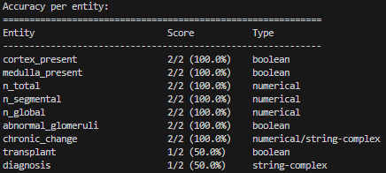

# Resource-Constrained Annotation Workflows for Paediatric Histopathology Reports

## 🚀 Introduction

This package contains the source code for an automated entity annotation pipeline for medical reports using local LLMs. 

Workflow Steps:

1. Preparation of annotation guidelines - clinical expert to provide guidelines (see entity_guidelines.xlsx)

2. Annotation of sample reports by the clinical expert using Streamlit application - this is used for evaluation purpose

3. Run the script for automated entity annotation

Optional Steps:

4. Disagreement modelling - To compare two different models for further manual reviewing.

5. Second Streamlit application for comparing and commenting on results from disagreement modelling


## 📚 Installations

### Setup and Sanity Check

*This takes roughly 20 minutes.*

```bash
# 0. Make sure you are in a terminal which can run conda commands

# 1. Clone the repository
git clone [repository_url]
cd [repository_name]

# 2. Run setup
setup.bat
```

*Following commands take roughly 5 minutes.*

Note: the paper results use llama3.2:3b-instruct-fp16 as the LAAJ but we use gemma2:2b-instruct-fp16 so an extra model doesn't need to be downloaded.

Run LLM annotation over synthetic data as a sanity check:
```bash
python rb_script.py --backend ollama --root_dir src/renal_biopsy --model_name qwen2.5:1.5b-instruct-fp16 --n_shots 2 --n_prototype 2 --include_guidelines --raw_data synthetic_data.xlsx --annotated_reports synthetic_annotations.json
```
- You should observe the following results .
- Check the outputs in src/renal_biopsy/data/runs/{timestamp}/predicted.json match project_files/annotation_results/qwen_annotations.json.


Run alternative model annotation over synthetic data as a sanity check:
```bash
python rb_alt_models_script.py --root_dir src/renal_biopsy/data --data_file synthetic_data.xlsx --annotated_reports_file synthetic_annotations.json --output_dir src/renal_biopsy/data/runs/alt_models
```
- Check the outputs in src/renal_biopsy/data/run/alt_models/evaluation_results.json match project_files/annotation_results/alt_model_results.json.

Run disagreement modelling over synthetic data as a sanity check:
```bash
python rb_disagreement_script.py --backend ollama --root_dir src/renal_biopsy --model_1_name qwen2.5:1.5b-instruct-fp16 --model_2_name gemma2:2b-instruct-fp16 --n_shots 2 --n_prototype 2 --disagreement_threshold 0.2 --include_guidelines --raw_data synthetic_data.xlsx
```
- Check the outputs (predicted.json files and entity_answers_over_corpus.json) in src/renal_biopsy/data/runs/{timestamp}/ match project_files/disagreement_results/.


### Usage

```bash
# 1. Activate conda environment
conda activate llm-annotation-env-test

# 2. Create input json (to be annotated) from raw data
python setup_input_json.py --guidelines guidelines.xlsx --raw_data [name of raw data]

# 3. Run annotation app
streamlit run src/renal_biopsy/annotation_app.py src/renal_biopsy src/renal_biopsy/data/real_input.json

# 4. Run alternative model annotation and evaluation
python rb_alt_models_script.py --root_dir src/renal_biopsy/data --data_file [raw report data] --annotated_reports_file [annotated data] --output_dir [output directory to save results]

# 5. Run LLM annotation and evaluation
python rb_script.py --backend [ollama/llamacpp] --root_dir src/renal_biopsy --model_name [model_name] --n_shots [n_few_shot_samples] --n_prototype [n_annotated_samples] --include_guidelines --raw_data [raw report data] --annotated_reports [annotated data]
# As a good initial test, we recommend the command below:
# python rb_script.py --backend ollama --root_dir src/renal_biopsy --model_name qwen2.5:1.5b-instruct-fp16 --n_shots 1 --n_prototype 1 --include_guidelines

# 6. Additional notebooks available for debugging:
# - eda.ipynb: for exploratory data analysis
# - redo_json_parsing.ipynb: for analysing parsing errors with any LLMs
# - update_laaj_and_eval.ipynb: for tweaking the LLM-as-a-Judge prompt and subsequently redoing the evaluation.

# 7. Run disagreement modeling between two models 
python rb_disagreement_script.py --backend [ollama/llamacpp] --root_dir src/renal_biopsy --model_1_name [model_1_name] --model_2_name [model_2_name] --n_shots [n_few_shot_samples] --n_prototype [n_annotated_samples] --disagreement_threshold [threshold] --include_guidelines --raw_data [raw report data]
# As a good initial test, we recommend the two commands below:
# ollama pull gemma2:2b-instruct-fp16
# python rb_disagreement_script.py --backend ollama --root_dir src/renal_biopsy --model_1_name qwen2.5:1.5b-instruct-fp16 --model_2_name gemma2:2b-instruct-fp16 --n_shots 1 --n_prototype 1 --disagreement_threshold 0.3 --include_guidelines

# 8. View disagreements in comparison app
streamlit run src/renal_biopsy/comparison_app.py src/renal_biopsy data/runs/{timestamp} [n_annotated_samples]
# Note: if there are no disagreements, this won't be able to run.
# TODO: comparison_comments.json currently saves to root directory, fix to save in timestamped folder.
```

### Adapting this project to your own area of biomedicine

```bash
# 1. Create project directory
mkdir src/{project_folder}

# 2. Set up data folder and files
mkdir src/{project_folder}/data
# Add your guidelines.xlsx and sample_data files to data/
# Minimum columns needed in guidelines.xlsx:
# - Entity
# - Entity Question To Ask  
# - Entity Type
# - Entity Code
# Example available in src/project_files/

# 3. Create preprocessor
touch src/{project_folder}/preprocessor.py
# Create {Project}Processor class inheriting MedicalReportProcessor
# Implement:
# - create_input_json()
# - process_all_reports() 
# - segment_report()
# Note: Entity Code names in guidelines.xlsx cannot clash with section headings you need to extract in segment_report()

# 4. Create QA module
touch src/{project_folder}/qa.py
touch src/{project_folder}/few_shots.py
# Create {Project}QA class inheriting QABase (Ollama/LlamaCpp)
# Implement:
# - get_few_shot_list() (store list in few_shots.py)
# - get_report_string()

# 5. Create annotation app
touch src/{project_folder}/annotation_app.py
# Create {Project}StreamlitApp class inheriting StreamlitAppBase
# Implement write_report_string_for_streamlit()
# Copy main section from existing renal_biopsy/annotation_app.py and modify it to suit your project

# 6. Run the annotation app from root directory
streamlit run src/{project_folder}/annotation_app.py \
   src/{project_folder} \
   src/{project_folder}/data/{input_json_name}.json
```

##  🤝 Acknowledgements
*This project was a five month internship funded by NHSE and supervised by NHSE and GOSH DRIVE*
* GOSH DRIVE Digital Research Environment (DRE) Team
* NHSE Data Science Team

##  🤝 Contributors
* Avish Vijayaraghavan - PhD student @ Imperial College London (core contributor)
* Dr. Pavi Rajendran - NLP & Computer Vision Lead @ GOSH DRIVE
* Dr. Neil J. Sebire - Clinical Lead @ GOSH DRIVE
* Dr. Dan Schofield - AI Technical Specialist @ NHSE
* Dr. Jonathan Hope - Data Science Lead Manager @ NHSE
* Dr. Jonny Pearson - Lead Data Scientist @ NHSE

For any queries, please contact us via email pavithra.rajendran@gosh.nhs.uk.

##  🧑🏽‍🤝‍🧑🏽 Citing & Authors

If you find this repository helpful, feel free to cite our publication [Resource Constrained Annotation Workflows for Paediatric Histopathology Reports](to be updated):

```
@article{
    title = "Resource Constrained Annotation Workflows for Paediatric Histopathology Reports",
    author = "Vijayaraghavan, Avish and Kawatra, Jaskaran Singh and Sabu, Sebin and Rigny, Louise and Howes, Seth and Sheldon, Jonny and Poulett, Will and Sebire, Neil and Pearson, Jonny and Schofield, Dan and Rajendran, Pavi and Hope, Jonathan",
    booktitle = "to be updated",
    month = "to be updated",
    year = "to be updated",
    publisher = "to be updated",
    url = "to be updated",
}
```

## 📃 Licenses

Code is this repository is covered by the GNU General Public License and for all documentation the [Open Government License (OGL)](https://www.nationalarchives.gov.uk/doc/open-government-licence/version/3/) is used.

Copyright (c) 2024 Crown Copyright